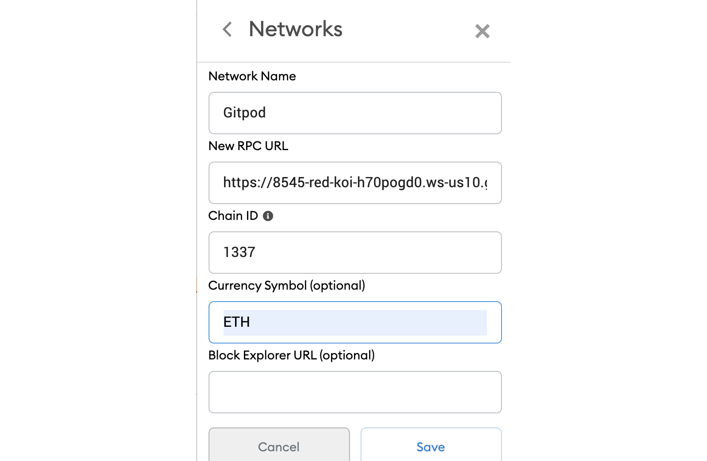

## Full stack NFT marketplace built with Polygon, Solidity, IPFS, & Next.js

### Run this project

The chain ID should be 1337. If you have a localhost rpc set up, you may need to overwrite it.



#### Local setup

To run this project locally, follow these steps.

1. Clone the project locally, change into the directory, and install the dependencies:

git clone 

install using NPM or Yarn
npm install

# or

yarn
```
2. Start the local Hardhat node

```sh
npx hardhat node
```

3. With the network running, deploy the contracts to the local network in a separate terminal window

```sh
npx hardhat run scripts/deploy.js --network localhost
```

4. Start the app

```
npm run dev
```
The project will run in local. 

